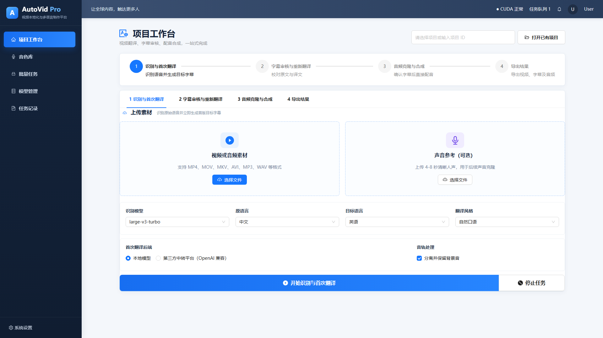

# AutoVidDub



本地视频中译英、字幕生成和音色克隆配音工具。默认流水线：

1. `faster-whisper` 识别中文并生成时间轴
2. `Helsinki-NLP/opus-mt-zh-en` 本地翻译，或使用 OpenAI 兼容接口
3. `CosyVoice2-0.5B` 用原视频声音跨语种克隆英文配音
4. FFmpeg 将分段配音按原时间轴混合，并输出视频和双语字幕

## Windows 一键启动

双击 `一键启动.bat`。首次运行会创建 `.venv`、安装依赖并下载推荐模型，耗时取决于网络速度。中国大陆默认使用 ModelScope，可在脚本提示中切换 Hugging Face。

以后双击 `启动.bat` 可直接启动。浏览器打开 `http://127.0.0.1:7860`。

## 模型

- 默认 ASR：`Systran/faster-whisper-small`，速度和准确率平衡
- 高质量 ASR：界面选择 `large-v3-turbo`，首次使用自动下载
- 默认翻译：`Helsinki-NLP/opus-mt-zh-en`
- 默认克隆 TTS：`iic/CosyVoice2-0.5B`
- CosyVoice2 使用跨语种复刻模式，中文参考音频无需填写参考文本即可生成英文

模型统一放在 `models/`，处理结果放在 `outputs/`。第三方服务密钥只保存在当前进程内，不写入配置文件。

## 命令行

```powershell
python download_models.py --source modelscope
python app.py
```

仅下载基础模型：

```powershell
python download_models.py --source huggingface --skip-tts
```

## 注意

- 只克隆本人或已获明确授权的声音。
- 12GB 显存可运行 CosyVoice2-0.5B；与大号 ASR 同时驻留时仍可能显存不足。
- 最佳参考音频是 3-12 秒、单人、无背景音乐的清晰语音。
